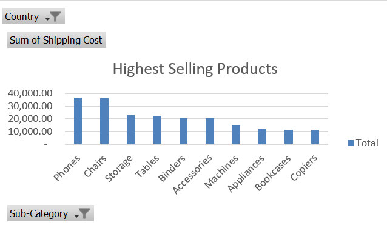
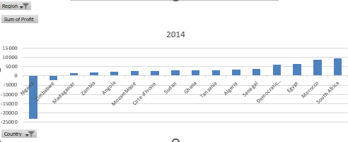
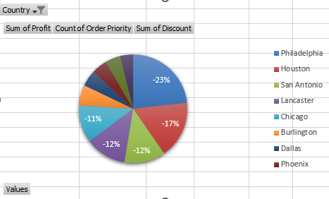

# Capstone-Global-Superstore-sales-survey

## Introduction

This is an excel Project on sales analysis of an imaginary store called **Capstone-global-superstore**. The project is to analyse and derive insights to answer crucial questions in allowing the store make data driven decisions in their sales strategy.
**_Disclaimer_**: _All datasets snad reports do not represent any company, this is just a dummy dataset to demonstrate the capabilities of data analysis via excel_

## Problem statement: To analyze the dataset and provide answers to the questions listed below.
- Problem 1.
1. Top 3 countries with the highest total profit for Global Superstore in 2014?
2. The top 3 products of 3. with the highest total profit.
- Problem 2.
1. Identify the 3 subcategories with the highest average shipping cost in the United States.
- Problem 3.
1. Nigeria’s profitability  for 2014, In comparison to other African countries?
2. What factors might be responsible for Nigeria’s poor performance?
- Problem 4.
1. Identify the product subcategory that is the least profitable in Southeast Asia.
2. What specific country in Southeast Asia should Global Superstore stop offering the subcategory identified in 4a)?
- Problem 5.
1.  Which city is the least profitable in the United States? 
2. Why is this city’s average profit so low?
- Problem 6.
1. Which product subcategory is the most profitable in Australia?
- Problem 7.
1. Who are the most valuable customers and what do they purchase?

## Skills/ concepts demonstrated: 
The following Excel features were utilized: 
- Pivot table 
- Data cleaning 
- Data modelling 
- Chart Presentation

## Visualization

The report coprises of 7 sheets that shows the solution to each problem

- Problem 2.
With this problem, i was able to identify the 3 Subcategories with the highest average shipping cost in the US via the use of a pivot table and represented the results visually with a bar chart
1. Phones
2. Chairs
3. Storage

- Problem3. 
Nigeria was outlined as the worst performing country in terms of profitability accross africa.

the data was also represented in the bar chart below

You can interact with the report here:

- Problem5.
Research shows Philadelphia has the highest discounts in the united states

## Conclusion and Recommendation
Sales in the global superstore can definitely be improved upon, if the above results are taken into consideration. Focusing on areas with demand and withdrawing sales of products in regions with no demand.

